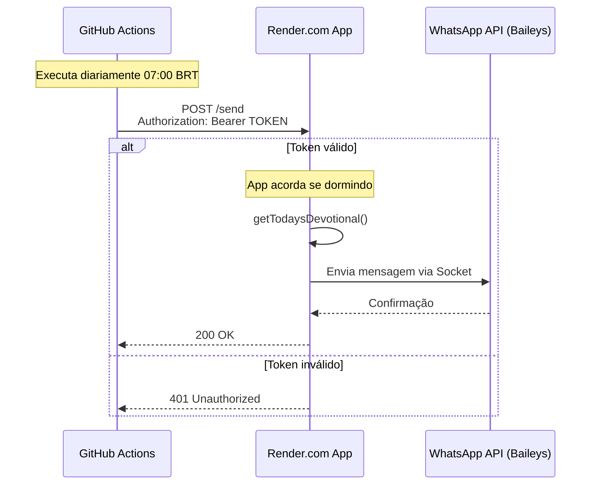

# 📖 Devocional WhatsApp Bot

Bot automatizado para envio diário de textos bíblicos devocionais via WhatsApp, desenvolvido em TypeScript com Bun.

## 🎯 Características

- ✅ **100% Gratuito**: Usa Baileys (API gratuita) + hospedagem gratuita (Render.com)
- 🤖 **Automatizado**: Envio diário acionado via GitHub Actions
- 🔧 **Configurável**: Horários e mensagens personalizáveis
- 📱 **WhatsApp Nativo**: Integração via WebSocket (Baileys)
- 🚀 **Moderno**: TypeScript + Bun para máxima performance
- 🪶 **Leve**: Consumo de memória otimizado (< 100MB) sem necessidade de Chrome
- 🔒 **Confiável**: Tratamento de erros e reconexão automática
- 🛡️ **Seguro**: Endpoint de disparo protegido por token

## 🏛️ Arquitetura

O bot utiliza uma arquitetura híbrida onde a aplicação fica hospedada no Render.com mantendo a sessão do WhatsApp, e o GitHub Actions atua como um "gatilho" diário para acordar a aplicação e disparar o envio.



## 🛠️ Tecnologias

- **Runtime**: [Bun](https://bun.sh/) 
- **Linguagem**: TypeScript
- **WhatsApp API**: [Baileys](https://github.com/WhiskeySockets/Baileys)
- **Hospedagem**: Render.com (Web Service)
- **Agendamento**: GitHub Actions

## 📋 Pré-requisitos

- [Bun](https://bun.sh/docs/installation) instalado
- Conta WhatsApp para o bot
- Grupo WhatsApp onde enviar as mensagens

## 🚀 Instalação e Configuração Local

### 1. Clone o repositório

```bash
git clone https://github.com/seu-usuario/devocional-picgama.git
cd devocional-picgama
```

### 2. Instale as dependências

```bash
bun install
```

### 3. Configure as variáveis de ambiente

```bash
cp .env.example .env
```

Edite o arquivo `.env`:

```env
# WhatsApp Configuration
WHATSAPP_SESSION_NAME=devocional-bot
GROUP_CHAT_ID=seu_grupo_id_aqui@g.us

# Security
AUTH_TOKEN=seu_token_secreto_aqui

# Application Configuration
NODE_ENV=development
DEBUG=false
```

### 4. Configure os textos devocionais

Edite o arquivo `data/readings-2026.json` com o plano de leitura.

## 🎮 Como usar

### Desenvolvimento

```bash
# Executar em modo desenvolvimento
bun run dev

# Testar conexão WhatsApp
bun run dev test

# Enviar mensagem teste via comando
bun run dev send
```

## ☁️ Deploy no Render.com

1. Crie uma conta no [Render.com](https://render.com/)
2. Crie um novo **Web Service** conectado ao seu repositório GitHub
3. Selecione o ambiente **Docker**
4. Configure as variáveis de ambiente no painel do Render:

| Variável | Descrição |
|----------|-----------|
| `NODE_ENV` | `production` |
| `GROUP_CHAT_ID` | ID do grupo (ex: `123456789@g.us`) |
| `WHATSAPP_SESSION_NAME` | `devocional-bot` |
| `AUTH_TOKEN` | Token secreto para proteger o envio (crie uma senha forte) |

5. Após o deploy, acesse a URL da sua aplicação `/qr` (ex: `https://sua-app.onrender.com/qr`) para escanear o QR Code.

## 🤖 Configuração do Agendamento (GitHub Actions)

O agendamento é feito pelo GitHub Actions para garantir que o envio ocorra mesmo se a aplicação no Render estiver "dormindo" (plano gratuito).

1. No seu repositório GitHub, vá em **Settings** > **Secrets and variables** > **Actions**
2. Adicione os seguintes Secrets:

| Secret | Descrição |
|--------|-----------|
| `SERVER_URL` | URL da sua aplicação no Render (ex: `https://sua-app.onrender.com`) |
| `AUTH_TOKEN` | O mesmo token definido nas variáveis do Render |

3. O workflow está configurado em `.github/workflows/deploy.yml` para rodar diariamente às 07:00 (Horário de Brasília).

## 🛡️ Segurança

O endpoint `/send` é protegido por um token Bearer. Qualquer requisição sem o header `Authorization: Bearer SEU_TOKEN` será rejeitada com status 401.

Para testar o envio manualmente via curl:

```bash
curl -X POST https://sua-app.onrender.com/send \
  -H "Authorization: Bearer seu_token_secreto" \
  -H "Content-Type: application/json"
```

## 🔧 Resolução de Problemas

### Render.com Free Plan
O plano gratuito do Render coloca a aplicação para dormir após 15 minutos de inatividade. Nossa arquitetura resolve isso: o GitHub Actions tenta acessar a aplicação, o que a "acorda". A requisição pode demorar um pouco mais, mas será processada.

### WhatsApp Desconectado
Se o WhatsApp desconectar:
1. Acesse `https://sua-app.onrender.com/qr`
2. Se necessário, adicione `?reconnect=true` para forçar nova autenticação
3. Escaneie o novo QR Code

## 🤝 Contribuindo

1. Fork o projeto
2. Crie uma branch para sua feature
3. Commit suas mudanças
4. Push para a branch
5. Abra um Pull Request

## 📄 Licença

Este projeto está sob a licença MIT. Veja o arquivo [LICENSE](LICENSE) para detalhes.
