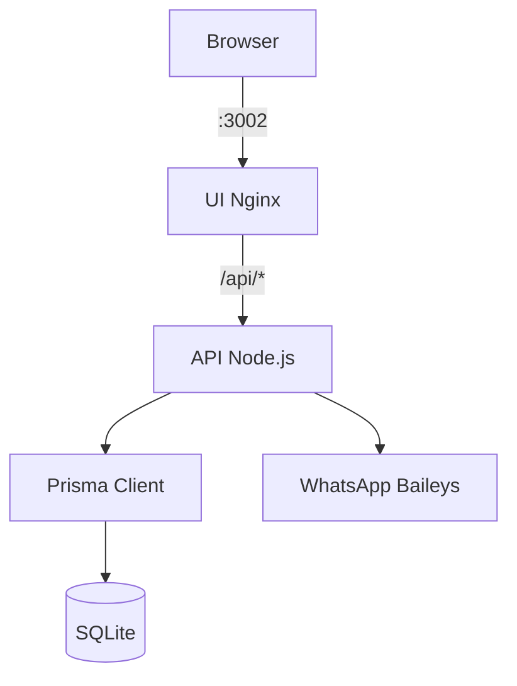

# Devocional Picgama Monorepo

Monorepo com API e painel administrativo separados.

## Arquitetura

- `apps/api`: API Node.js + TypeScript + Prisma + Baileys
- `apps/ui`: painel administrativo React + Vite + Mantine (dark)
- `packages/shared`: tipos compartilhados entre API e UI

## Requisitos

- Node.js 22+
- Yarn 1.22+
- Docker + Docker Compose

## Instalação

```bash
yarn install
```

## Configuração

```bash
cp .env.example .env
```

Variáveis principais:

- `API_PORT` porta externa da API
- `UI_PORT` porta externa do painel (padrão: 3002)
- `AUTH_TOKEN` token Bearer para endpoints protegidos
- `DATABASE_URL` conexão SQLite usada pelo Prisma
- `WHATSAPP_SESSION_NAME` nome da sessão WhatsApp

## Desenvolvimento

Rodar tudo:

```bash
yarn dev
```

Rodar apenas API:

```bash
yarn dev:api
```

Rodar apenas UI:

```bash
yarn dev:ui
```

## Produção com Docker

```bash
docker compose up -d --build
docker compose logs -f
docker compose down
```

Serviços:

- API: `http://localhost:4000` (ou `API_PORT`)
- UI: `http://localhost:3002` (ou `UI_PORT`)

## API

Endpoints públicos:

- `GET /`
- `GET /health`
- `GET /readings`
- `GET /readings/today`
- `GET /docs`
- `GET /api-docs`
- `GET /scheduler/status`

Endpoints protegidos por Bearer token:

- `POST /send`
- `GET /qr` (`?reconnect=true` opcional)
- `POST /scheduler/start`
- `POST /scheduler/stop`
- `GET /api/recipients`
- `POST /api/recipients`
- `GET /api/recipients/:id`
- `PUT /api/recipients/:id`
- `DELETE /api/recipients/:id`

## Prisma

Schema em:

- `apps/api/prisma/schema.prisma`

Comandos:

```bash
yarn workspace @devocional/api prisma:generate
yarn workspace @devocional/api prisma:migrate
```

## Fluxo em produção


```mermaid
graph TB
  Browser[Browser] -->|:3002| UI[UI Nginx]
  UI -->|/api/*| API[API Node.js]
  API --> Prisma[Prisma Client]
  Prisma --> SQLite[(SQLite)]
  API --> WA[WhatsApp Baileys]
```

## Licença

MIT
