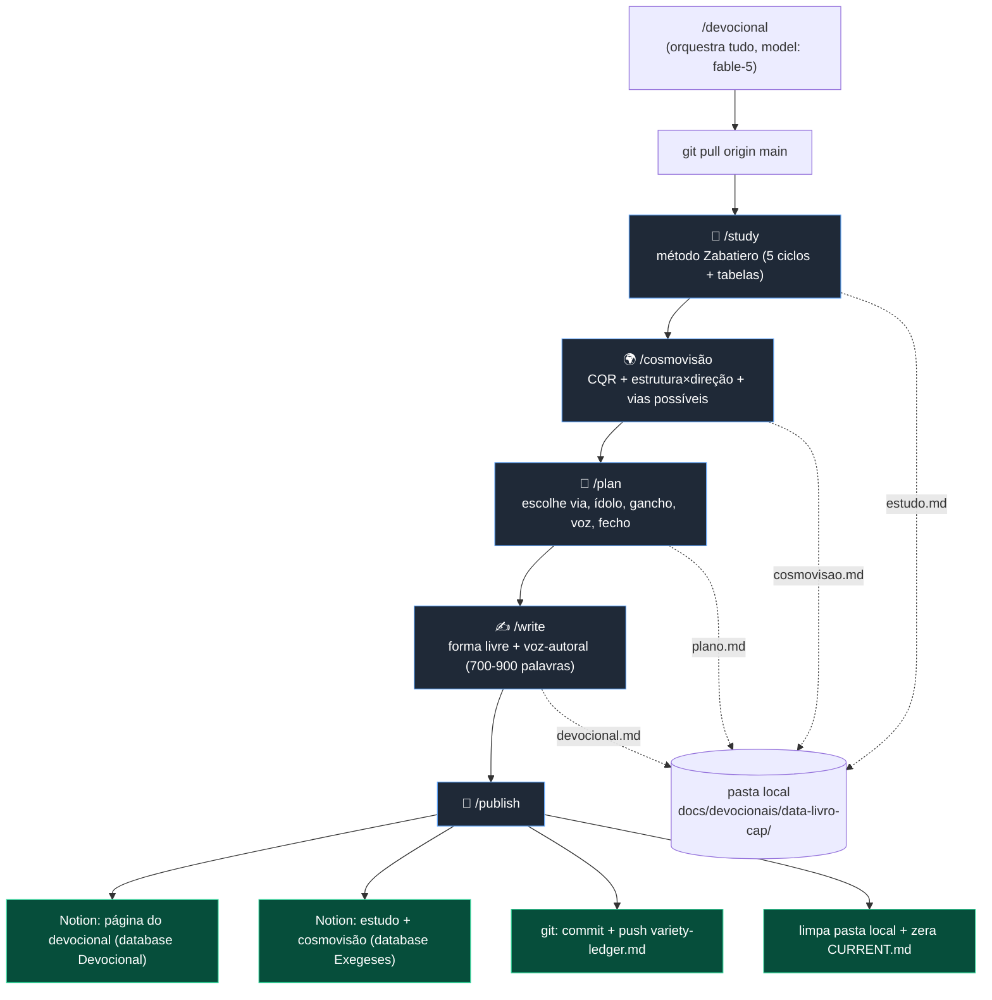

# Fluxo do Devocional — Mapa Rápido

> Visão geral do pipeline para leitura rápida (não precisa abrir cada skill). Detalhe de cada passo está no `.claude/commands/<skill>.md` correspondente.

## Passos

| Passo | Entrada | Saída | Decide / Faz | Referências lidas |
|---|---|---|---|---|
| **/study** | data ou referência | `estudo.md` + `CURRENT.md` | exegese semio-discursiva: tradução, preparação, **5 ciclos** (espaço-temporal, teológica, sociocultural, psicossocial, missional) com tabelas. **NÃO** faz CQR nem cristologia. | `theology/zabatiero-semio-discursivo.md` |
| **/cosmovisão** | `estudo.md` | `cosmovisao.md` | leitura **Criação-Queda-Redenção** (3 atos), **estrutura×direção** (Wolters), **lista** vias cristológicas possíveis (hierarquia), gancho de cosmovisão. | `theology/cosmovisao-criacao-queda-redencao.md`, `greidanus-vias-cristologicas.md`, `pactualismo-progressivo.md` |
| **/plan** | `estudo.md` + `cosmovisao.md` | `plano.md` | **escolhe** a via; nomeia o ídolo; ideia central, gancho, voz, fecho (alterna), variação (anti-repetição via ledger). Herda CQR. | `greidanus-vias-cristologicas.md`, `estilo/temas-criticos.md` |
| **/write** | `plano.md` | `devocional.md` + entrada no `variety-ledger.md` | roteiro em **forma livre** (sem molde de parágrafos), 700-900 palavras, bordas fixas (título/descrição/intro), anti-IA. | `estilo/linguagem-falada.md`, `estilo/voz-autoral.md`, `estilo/temas-criticos.md` (se o plano pedir) |
| **/publish** | pasta completa | Notion (2 databases) + ledger commitado + estado limpo | publica devocional (database Devocional) e estudo+cosmovisão (database Exegeses); commita ledger; apaga pasta; zera `CURRENT.md`. | `CURRENT.md` |

## Invariantes (nunca quebrar)

- **Cristo no centro** por uma via de Greidanus (listada na cosmovisão, escolhida no plan).
- **Arco Criação-Queda-Redenção** no pensamento — mas as palavras não precisam aparecer no texto final.
- **Exegese fiel** (Zabatiero) é a base — texto manda, não vira pretexto.
- **Bordas fixas:** título `DD/MM: Quando ... (Referência)`, descrição Spotify, intro "Bom dia, hoje é dia...".
- **700-900 palavras** no roteiro; Bíblia entra cedo.
- **Regra Keller:** sem personagem inventado. **1ª pessoa só universal.**
- **Norte:** matar o tom IA/genérico (ver `estilo/voz-autoral.md`).

## Estado e arquivos

- **`docs/devocionais/CURRENT.md`** — estado do devocional em andamento; lido por todas as skills; **não vai pro git** no fluxo (uso local).
- **`docs/devocionais/variety-ledger.md`** — registro acumulativo anti-repetição; **commitado** a cada publicação.
- **Pasta local `{data}-{livro}-{cap}/`** — `estudo.md`, `cosmovisao.md`, `plano.md`, `devocional.md`; apagada no `/publish` (conteúdo vive no Notion).
